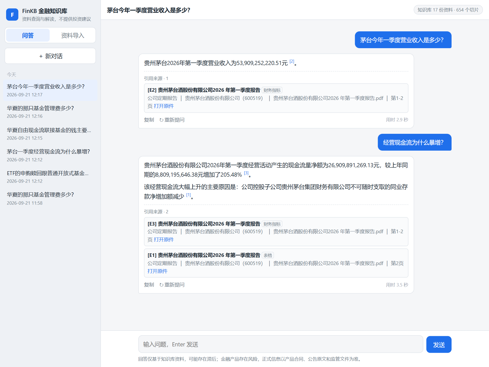
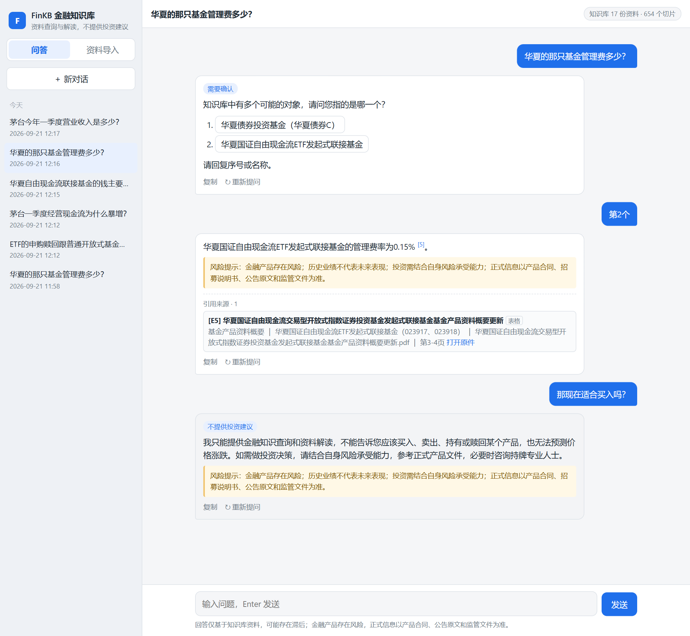
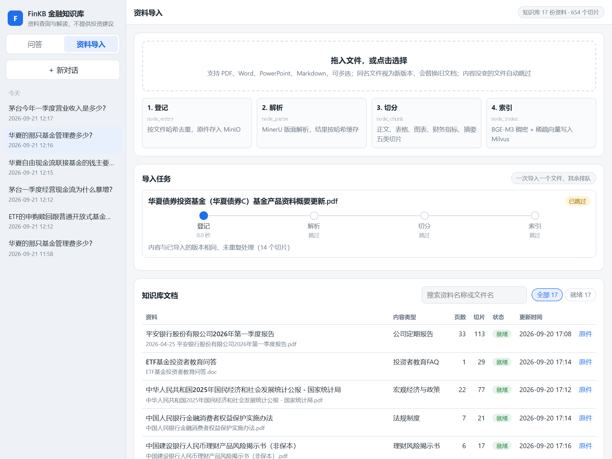

# FinKB 金融知识库

面向普通用户的金融知识问答系统。用自然语言提问，系统从已导入的金融资料（上市公司季报、基金产品资料概要、理财风险揭示书、宏观政策报告、投资者教育问答等）中查找依据，流式给出带引用、符合合规要求的回答。

它是资料查询与解读工具：**不提供个性化投资建议，不承诺收益**；资料里没有的内容明确告知，不编造数据。



| 澄清对象与合规提示 | 资料导入 |
|---|---|
|  |  |

## 功能

- **有依据的回答**：数字按原文原值给出，关键信息后标注 `[E1]` 这样的证据编号；来源卡片列出资料名称、内容类型、产品名称与代码、文件名、页码和原件链接。
- **六种回答类型**：依据资料回答、资料不足时拒答、对象有歧义时请用户确认、不提供投资建议、提示非实时数据、寒暄。
- **合规**：禁用表达（保本保收益、稳赚不赔等）按句拦截，能识别“不承诺保本”这类否定说法和“以保本为诱饵”这类描述骗局的语境；涉及基金理财时追加风险提示，问到最新行情时追加时效提示。
- **多轮对话**：追问可以省略对象（“它的现金流呢”）；需要确认对象时，直接点候选或回复“第一个”“债券那只”。
- **资料导入**：在页面上拖入文件，实时显示登记、解析、切分、索引四个步骤的进度；也可以用命令行批量导入整个目录。内容没变的文件自动跳过，同名文件的新版本会替换旧文档。

## 架构

两张 LangGraph 图：导入图把原件变成可检索的切片，查询图把问题变成回答。节点逻辑写在 `processor/*/nodes/`，工具函数在 `utils/`。

**导入图**：`node_entry → node_parse → node_chunk → node_index`，一次处理一个文件。

| 节点 | 做什么 | 产出 |
|---|---|---|
| node_entry | 按文件哈希判定新增、重做或跳过；删除同名旧版本；原件上传 MinIO | Mongo `documents` 记录 |
| node_parse | pdf / Word / PowerPoint 提交 MinerU 解析，md 本地解析；结果按文件哈希缓存 | `content_list.json` |
| node_chunk | 丢弃页眉页码、推断标题层级、合并跨页段落和表格、描述图片；产出正文、表格、图表描述、财务指标、文档摘要五类切片 | `chunks.json` |
| node_index | BGE-M3 计算稠密和稀疏向量，写入后清掉该文档的旧切片，文档置为就绪 | Milvus `fin_chunks` |

**查询图**：`node_query_plan → node_gather_evidence → node_answer_output`，节点通过 SSE 流式推送。

| 节点 | 做什么 |
|---|---|
| node_query_plan | 结合对话历史，把问题改写成完整的独立问题，并抽取提到的对象；上一轮在等用户确认对象时，按序号或名称直接匹配候选，不调用模型 |
| node_gather_evidence | 把提到的对象对应到实体表；稠密和稀疏混合检索取 20 条（Milvus 内置 RRF 融合，问题指向具体对象时只在其文档内检索），`qwen3-rerank` 精排取 8 条，编号 E1～E8 |
| node_answer_output | 模型按 [规则手册](common/prompt/answer_system.prompt) 一次输出回答类型和正文；代码负责三道闸门：禁用表达按句拦截、删掉证据里不存在的引用编号、一条证据都没有时直接输出固定拒答话术；最后追加提示语、生成来源列表、写入会话 |

设计要点：

- **判定交给模型，代码只守底线**：回答、拒答、澄清等六种类型由模型按规则手册判断，结果写在正文后 `<<<META>>>` 那一行 JSON 里；合规和引用由代码兜底。
- **证据只有一种**：五类内容都是切片，走同一条检索路径。季报的“主要会计数据”表在导入时就拆成每行一条的财务指标切片，所以数值题回答的都是原值。
- **表格友好的切分**：表格单独成块，展开合并单元格、识别子表头、并入单位行，按“列名=值”线性化后再计算向量。
- **可追溯**：模型只写证据编号，来源信息由代码根据切片元数据渲染，不会出现编造的出处。

## 技术栈

| 用途 | 选型 |
|---|---|
| 流程编排 | LangGraph |
| 服务 | FastAPI，流式输出用 SSE |
| 向量检索 | Milvus 2.5：稠密向量走 HNSW，稀疏向量走倒排索引，两路结果用 RRF 融合 |
| 文档记录与会话 | MongoDB |
| 原件存储 | MinIO |
| 文档解析 | MinerU 精准解析 API |
| 向量编码 | BGE-M3，本地 CPU 运行，同时输出稠密和稀疏向量 |
| 大模型 | 阿里云百炼（OpenAI 兼容接口）：生成用 `qwen3.8-flash`，精排用 `qwen3-rerank`，图片描述用 `qwen3-vl-flash` |

## 目录结构

```text
cli.py                    命令行入口
api/                      query_service.py（问答 + 页面，端口 8001，导入接口挂在 /import 下）  file_import_service.py（导入，可单独运行，端口 8000）
page/chat.html            页面（问答 + 资料导入）
processor/                import_processor/  query_processor/（各有 state.py、main_graph.py、nodes/）
utils/                    clients/（Milvus、Mongo、MinIO、MinerU、会话）  lm/（对话、BGE-M3、精排）  其他工具函数
common/                   config/（每个组件一个配置文件）  logging/  prompt/*.prompt  answer_templates.py（固定话术）
evaluation/               评测集自检、检索评测、答案评测
data/entities.json        实体表（手写）
data/eval/                评测集 fin_eval_set.jsonl 与评测结果 results/
tests/                    unit/  integration/
```

## 快速开始

需要准备：Windows x64、Python 3.12、[uv](https://docs.astral.sh/uv/)、本地 BGE-M3 模型（CPU 即可）；中间件 Milvus 2.5、MongoDB（开启认证）、MinIO；外部服务 MinerU 精准解析 API、阿里云百炼。

```bash
uv sync
cp .env.example .env                                # 填入真实值；.env 不入库，配置项说明见 .env.example
uv run python cli.py check                          # 检查中间件与外部服务的连通性
uv run python cli.py ingest "D:\path\to\金融\数据"    # 导入目录；可重复执行，内容没变的文件跳过
uv run python -m api.query_service                  # 启动服务，打开 http://127.0.0.1:8001
```

命令行工具：

```bash
uv run python cli.py status                         # 各文档的导入状态
uv run python cli.py search "茅台一季度营业收入"     # 调试检索，可用 --kind / --content-type 过滤
uv run python cli.py ask "华夏债券C的托管费是多少？"  # 命令行问答；不带问题进入多轮交互，--session <id> 接着已有会话问
```

`ingest` 另有 `--force`（已就绪的文档也重建）、`--reparse`（忽略解析缓存，重新调用 MinerU）、`--only <子串>`（只处理文件名包含该子串的文件）。解析结果按文件哈希缓存在 `data/artifacts/`。

## 接口

| 接口 | 说明 |
|---|---|
| `POST /query` | 请求体 `{"question", "session_id"?}`，返回 `text/event-stream`，依次推送：`delta`（增量文本）、`sources`（引用来源）、`final`（session_id、kind、完整回答）；出错时推送 `error`（面向用户的提示） |
| `GET /sessions` | 最近的会话 |
| `GET /sessions/{id}/messages` | 一个会话的问答记录 |
| `POST /import/documents` | 上传文件（pdf / doc / docx / ppt / pptx / md），后台逐个导入，每个文件返回一个 `task_id` |
| `GET /import/tasks` | 导入任务进度：状态、已完成的节点及各自耗时、登记结果（new / redo / skip） |
| `GET /import/documents` | 文档列表与导入状态 |

`kind` 的取值：`answer`（依据资料回答）、`refuse`（资料不足）、`clarify`（需要确认对象）、`decline_advice`（不提供投资建议）、`realtime_notice`（非实时数据）、`chitchat`（寒暄）。

导入接口也可以用 `uv run python -m api.file_import_service` 单独启动（端口 8000，路径不带 `/import` 前缀，接口文档在 <http://127.0.0.1:8000/docs>）。

## 测试与评测

评测集共 67 题、75 轮问答，覆盖产品、公告资讯、风险、知识、流程、负例、合规探针和 4 组多轮对话。标准答案用“文件名 + 关键原句”标注，按规则打分，不用 LLM 当裁判。

```bash
uv run pytest                                              # 单元测试
uv run pytest -m integration                               # 集成测试，需要中间件与外部服务
uv run python -m evaluation.runner --tag <标签> --mode answer  # 评测；默认只评检索，--mode answer 走完整问答链路
```

当前结果（`data/eval/results/2026-09-20_simplify-batch4-answer.json`）：

| 指标 | 结果 |
|---|---|
| 回答类型准确率（8 个类别都是 1.0） | 1.0 |
| 负例拒答率 / 正例误拒率 | 1.0 / 0 |
| 合规违规（禁用表达、投资建议措辞） | 0 |
| 必含内容通过率 | 0.96 |
| 多轮对话 | 4 / 4 |
| 证据中包含标准原句 / 引用的文件包含标准文件 | 0.98 / 1.0 |
| 单次问答耗时：中位数 / p90 | 3.5 s / 5.8 s |

只评检索（混合检索，不含精排）时，切片级 Hit@5 为 0.84、MRR@10 为 0.66，文档级 Hit@5 为 1.0。

性能：在服务进程内直接调用问答处理函数（不经过 HTTP 层）压测 8 路并发，吞吐约 1.5 次/秒，首字耗时中位数约 2.5 秒，没有出错。本机的瓶颈在 CPU 上的 BGE-M3 编码，约每秒 8～10 次。

## 已知问题

- MinerU（vlm 模式）偶尔漏识别正文里的数字：招商银行季报有少数正文数字缺失；《基金基础知识》用的是伪粗体排版，数字识别率很低。表格里的数值不受影响。
- 个别产品费率题检索不到对应的费用表，例如易方达智造 C 的销售服务费。
- 回答类型由模型判断，温度设为 0 也会有波动，个别题的归类可能因此变化。
- 导入主要耗时在 CPU 上计算向量，导入任务串行执行。导入进度只保存在服务内存里，重启后清空，但文档状态不受影响。
